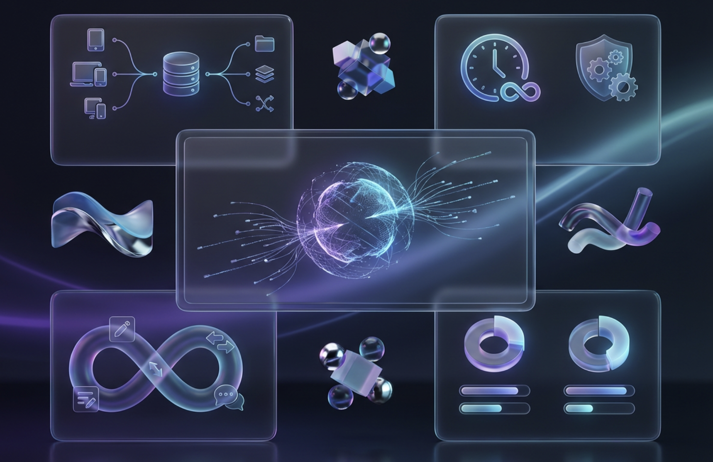
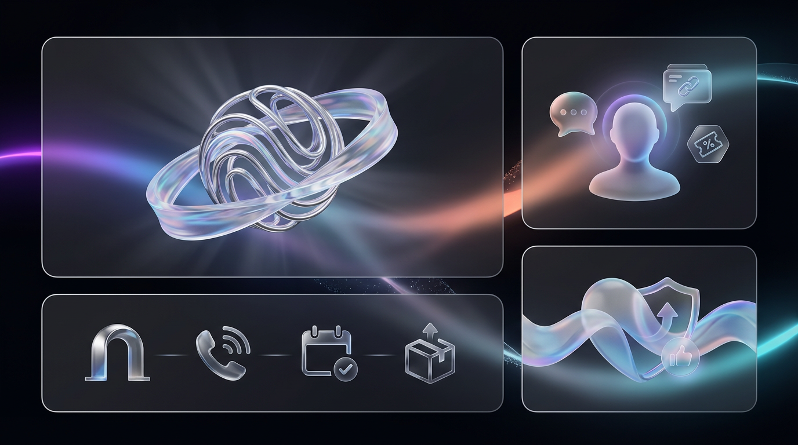
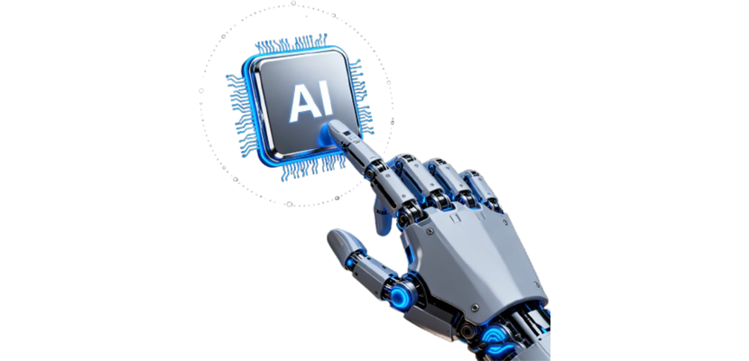
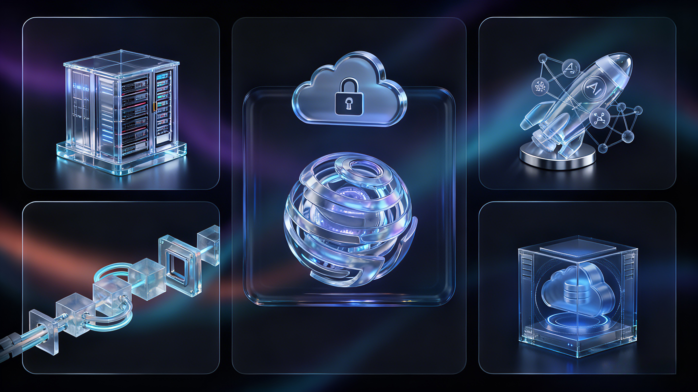
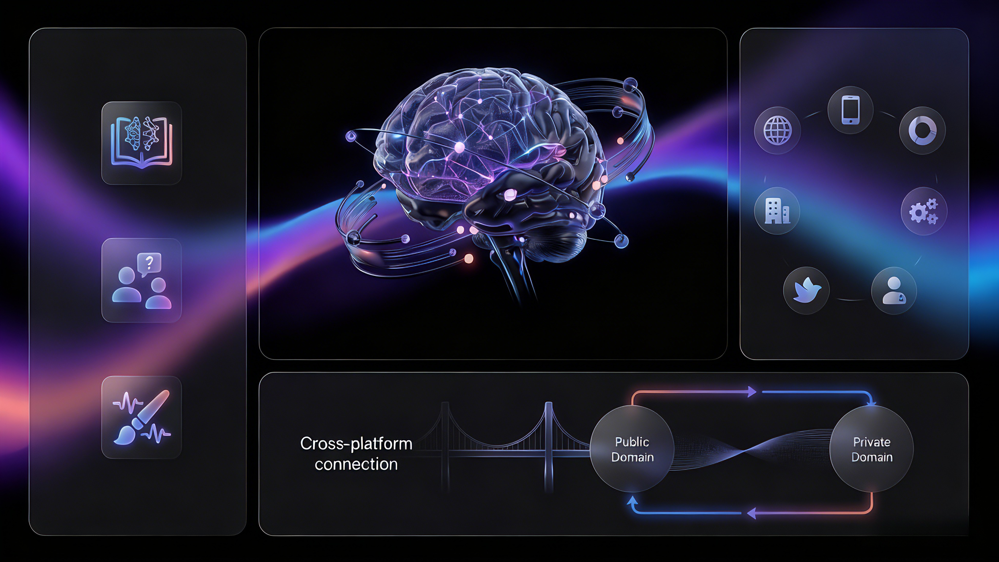
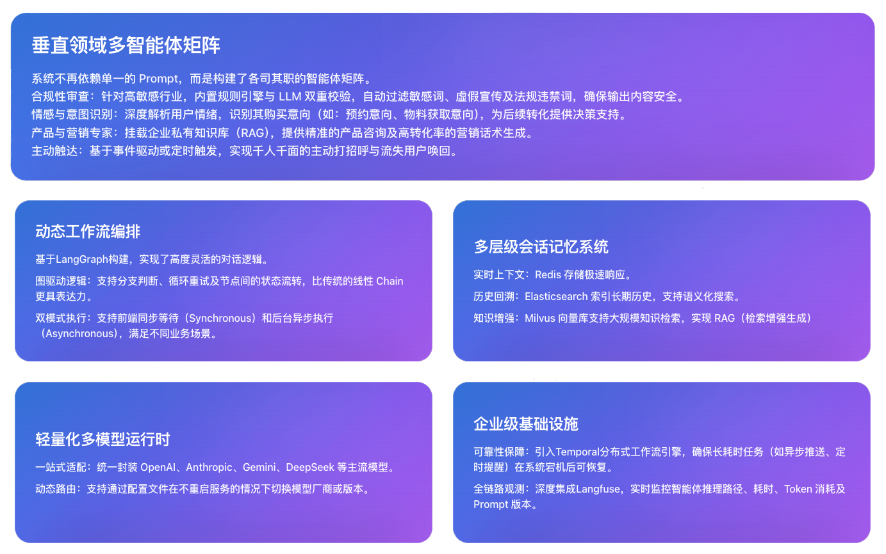

# 客隆体 AI - 公域AI获客，私域AI接管

#### 客隆体 AI 是基于环目超脑 MAS 能力框架开发的自动化商业经营系统，结合全球顶尖的 AI 大模型，打造自动化营销 AI 员工矩阵，覆盖「公域曝光、私域销售、售后服务、客户裂变、客情经营」全生命周期，主要应用于自动化公域曝光、私域销售、售后裂变的客户经营闭环。

## 核心特性

  

    <h3 style="margin-top: 0; color: #333; font-size: 18px; font-weight: 600;"> 公私域自动运营</h3>
    <ul style="margin: 10px 0; padding-left: 20px; color: #666; line-height: 1.8;">
      <li>自动化运营抖音、小红书等平台，批量产出高质量线索，实现公私域自动运营闭环</li>
      <li>公域内容精准曝光、全维度互动、精准引流私域</li>
    </ul>
  

    <h3 style="margin-top: 0; color: #333; font-size: 18px; font-weight: 600;">拟人化 + 多模态</h3>
    <ul style="margin: 10px 0; padding-left: 20px; color: #666; line-height: 1.8;">
      <li>模拟真人声音、语气、表达习惯等特征</li>
      <li>支持私聊、群聊、朋友圈的文字、语音、图片、链接等多维度互动</li>
    </ul>
  

    <h3 style="margin-top: 0; color: #333; font-size: 18px; font-weight: 600;">强记忆 + 主动智能</h3>
    <ul style="margin: 10px 0; padding-left: 20px; color: #666; line-height: 1.8;">
      <li>全面记忆与客户的所有沟通内容，精准响应客户需求</li>
      <li>启发式主动对话，主动邀约、主动发送信息、主动推送商品 / 下单链接</li>
    </ul>
  

    <h3 style="margin-top: 0; color: #333; font-size: 18px; font-weight: 600;">自进化 + 快速应用</h3>
    <ul style="margin: 10px 0; padding-left: 20px; color: #666; line-height: 1.8;">
      <li>内置多个行业标准人设，基于成熟的多智能体协作框架</li>
      <li>自我设定周期思考，主动进化，持续提高商业转化率，实现快速部署应用</li>
    </ul>
  

## 核心功能模块

  <h3 style="margin-top: 0; margin-bottom: 15px; color: #333; font-size: 20px; font-weight: 600;">公域曝光</h3>
  

    

      <ul style="margin: 0; padding-left: 20px; color: #666; line-height: 1.8; list-style-type: disc;">
        <li>批量运营多个主流公域平台，批量产出内容、点赞评论、私信回复等，稳定获取意向客户线索</li>
        <li>内容创作 + 账号矩阵 + 评论区引流 + 私信回复，形成完整闭环</li>
        <li>7×24 小时稳定运行，内置智能节律与风控策略</li>
      </ul>
    

    

      
    

  

  <h3 style="margin-top: 0; margin-bottom: 15px; color: #333; font-size: 20px; font-weight: 600;">私域经营</h3>
  

    

      
    

    

      <ul style="margin: 0; padding-left: 20px; color: #666; line-height: 1.8; list-style-type: disc;">
        <li>采用 AI + VLM 技术安全操作私域，AI 分身识别客户需求、主动沟通</li>
        <li>AI RPA + VLM 技术安全批量操作私域账号</li>
        <li>推送商品卡 / 下单链接 / 优惠券 / 小程序</li>
        <li>覆盖邀约到店 / 预约通话 / 拜访安排 / 商品推送全链路</li>
        <li>售后关怀与客情维护，提升复购与口碑</li>
      </ul>
    

  

## 合作与部署形式

  <h3 style="margin-top: 0; margin-bottom: 15px; color: #333; font-size: 20px; font-weight: 600;">企业级 OEM</h3>
  

    

      <ul style="margin: 0; padding-left: 20px; color: #666; line-height: 1.8; list-style-type: disc;">
        <li>智能体定制：企业知识库 / 内部咨询问答 / 多模态内容创作智能体</li>
        <li>多渠道接入：企业官网 / 小程序 / 公众号 / 企业微信 / ERP / 飞书 / 个人微信等</li>
        <li>跨平台打通：可与公域 / 私域深度打通，闭环提效</li>
        <li>部署形式：贴牌定制、SaaS 部署</li>
      </ul>
    

    

      
    

  

  <h3 style="margin-top: 0; margin-bottom: 15px; color: #333; font-size: 20px; font-weight: 600;">私有化定制</h3>
  

    

      <ul style="margin: 0; padding-left: 20px; color: #666; line-height: 1.8; list-style-type: disc;">
        <li>面向群体：数字化企业、大型客户企业、AI 创业团队、同行</li>
        <li>开放定制：环目超脑 MAS 能力框架、客隆体 AI 产品全部能力</li>
        <li>特性：可无限延展，支持私有化部署</li>
        <li>部署形式：源代码交付、私有化部署、绝对自控</li>
      </ul>
    

    

      
    

  

  <h3 style="margin-top: 0; margin-bottom: 15px; color: #333; font-size: 20px; font-weight: 600;">合作加盟</h3>
  

    

      <ul style="margin: 0; padding-left: 20px; color: #666; line-height: 1.8; list-style-type: disc;">
        <li>合作内容：全产品与服务开放合作</li>
        <li>授权形式：开放省 / 市 / 行业 / 线上授权，渠道代理授权、贴牌合作</li>
        <li>收益优势：大比例分成 + 持续管道收益 + 事业共创伙伴</li>
        <li>优势：低成本开启 AI 商业变现</li>
        <li>总部赋能：流量分发 / 营销活动 / 物料支持 / 客户交付 / 售后服务</li>
        <li>适合群体：超级个体、业务型企业、数字化服务商、掌握商务资源的个体</li>
      </ul>
    

    

      
    

  

---

# MAS 智能营销助手

MAS（Marketing Agent System）是面向医美与美妆场景的多智能体营销助手。后端基于 FastAPI 与 LangGraph，围绕“线程 → 工作流 → 智能体”构建会话处理链路，并配套 Redis、Elasticsearch、Milvus 等存储选项以及 Langfuse 观测平台。仓库同时包含 Next.js 前端和完整的 Docker Compose 环境，便于快速体验与调试。

## 功能亮点

- LangGraph 驱动的多智能体工作流，内置聊天、合规、产品、情感、记忆等模块，位于 `api/core/agents` 与 `api/core/workflows`
- FastAPI 服务分层清晰：`controllers` 提供路由，`services` 聚合业务逻辑，`models`/`schemas` 定义数据约束
- 轻量化多 LLM 运行时（`api/infra/runtimes`），默认支持 OpenAI、Anthropic，并可通过 `data/models.yaml` 扩展模型列表
- 会话记忆覆盖 Redis 短期存储（ConversationStore）、可选 Elasticsearch 长期索引与 Milvus 向量检索
- `docker/` 目录提供开发/生产 Compose 文件和 Langfuse 观测链路，适合端到端联调
- `web/` 下的 Next.js 应用用于运营平台与可视化面板（详见子目录自带文档）

---

如果感兴趣，请联系 [客隆体AI](https://www.consumerclone.com/)

